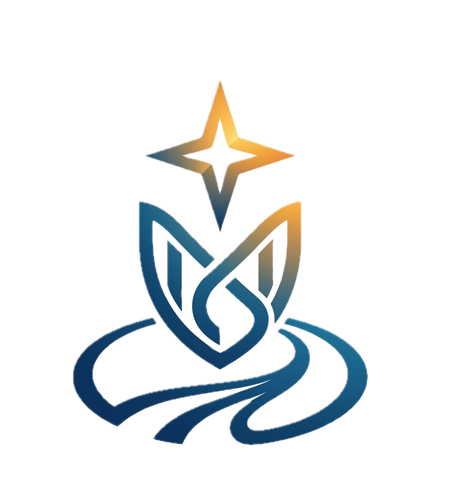
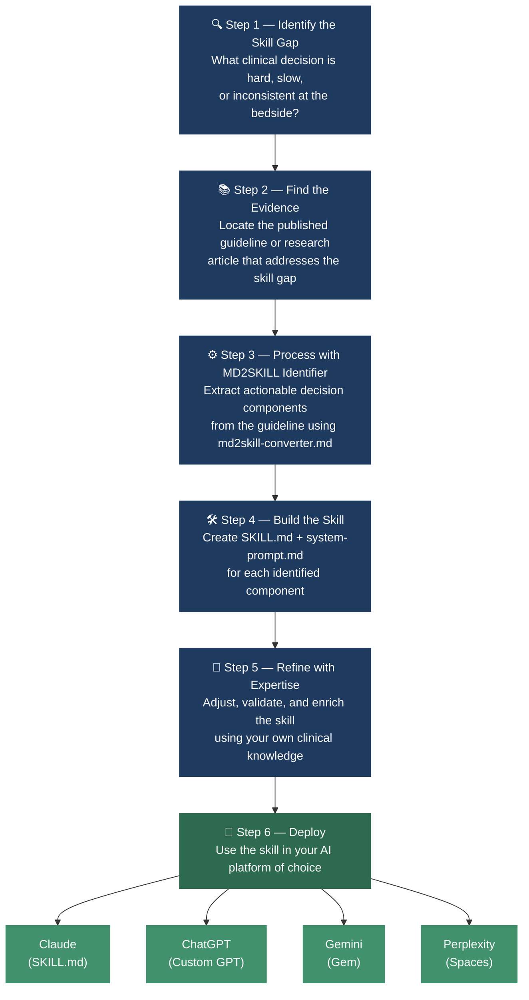

<p align="center">
  
</p>

# MD2SKILL

**Convert your MD to Skill.MD**

An open-source library of clinical decision support skills built from published medical guidelines. Each skill is a structured, step-by-step prompt that turns any AI assistant into a bedside clinical tool.

<p align="center">
  <strong>885 skills</strong> · <strong>11 specialties</strong> · grounded in published guidelines · MIT licensed
</p>

---

## What Is This?

Medical guidelines are long, dense, and hard to use mid-clinic. MD2SKILL extracts the actionable, decision-making parts and converts them into structured prompts (skills) that work with any AI tool.

Instead of reading a 40-page guideline to classify a diabetic foot infection, you describe the case and your AI walks you through the exact same framework — step by step, in real time.

**Not a summary. A clinical decision tool.**

---

## The MD2SKILL Pipeline



> Full methodology: [`meta/md2skill-philosophy.md`](meta/md2skill-philosophy.md) · Skill builder: [`meta/md2skill-converter.md`](meta/md2skill-converter.md)

---

## Supported Platforms

Each skill has two files:

| File | For |
|---|---|
| `SKILL.md` | **Claude · OpenClaw · Perplexity Computer** — native skill install, auto-triggers |
| `system-prompt.md` | **ChatGPT · Gemini · Perplexity Spaces** — paste as Instructions |

### Use with ChatGPT Custom GPTs

Two modes — see **[`meta/chatgpt-custom-gpt-setup.md`](meta/chatgpt-custom-gpt-setup.md)** for full instructions:

| Mode | When to use | What to do |
|---|---|---|
| **Single-skill GPT** | One GPT, one clinical task | Paste `system-prompt.md` into Instructions field |
| **Multi-skill GPT** | One GPT, multiple related skills | Paste master routing prompt into Instructions + upload `SKILL.md` files to Knowledge |

The **[`meta/chatgpt-master-system-prompt.md`](meta/chatgpt-master-system-prompt.md)** file contains a copy-paste ready master prompt with routing logic, skill chaining, structured response format, and a worked example (Transplant Medicine — DBD Donor Eligibility + MAPI Score Calculator).

---

### SKILL.md — Native install

| Platform | How to install |
|---|---|
| **Claude** (Cowork / Claude Code) | Drop into `.claude/skills/<skill-name>/` |
| **OpenClaw** | Install via the platform's skill installer |
| **Perplexity Computer** | Install via the platform's skill installer |

### system-prompt.md — Paste as Instructions

| Platform | Where to paste |
|---|---|
| **ChatGPT Custom GPT** | GPT Builder → Configure → Instructions |
| **ChatGPT Projects** | Project → Instructions |
| **Gemini** | gem.google.com → Create a Gem → Instructions |
| **Perplexity Spaces** | Space → Settings → Instructions |

---

## Skills Library

885 skills across 11 specialties. The tables below show coverage by sub-specialty — click any folder link to browse the skills inside.

### 🩺 Endocrinology — 833 skills

| Sub-specialty | Skills | Scope |
|---|---:|---|
| [Pituitary & Acromegaly](skills/endocrinology/pituitary/) | 98 | Acromegaly diagnosis & management (SRL/pegvisomant/surgery/RT), central diabetes insipidus (DDAVP protocols), central hypothyroidism (LT4 dosing, TSH targets), pituitary apoplexy, prolactinoma, GH deficiency testing & replacement, hypopituitarism workup, LH/FSH/ACTH/TSH deficiency (ES 2025 guidelines) |
| [Adrenal](skills/endocrinology/adrenal/) | 115 | ES-PA (ARR screening, AVS, MRA selection), JES-PA (confirmatory tests, pregnancy), ESA-PA (18-oxo/18-OHB interpretation, GRA management), ENDA primary adrenal insufficiency (glucocorticoid/mineralocorticoid dosing, sick-day rules, crisis management), ATA secondary AI (stress dosing, HPA axis recovery) |
| [Phaeochromocytoma & PPGL](skills/endocrinology/phaeochromocytoma/) | 70 | Full ATA-PPGL + JES-PPGL set — screening, biochemistry, imaging modality selection (123I-MIBG / 68Ga-DOTATATE / 18F-FDG-PET), genetic testing, GAPP/COPPS/PASS metastasis risk scoring, surgical approach, perioperative alpha-blockade, pregnancy, metastatic treatment, radionuclide therapy |
| [Hypogonadism, FHA & Hirsutism](skills/endocrinology/hypogonadism/) | 128 | Functional hypothalamic amenorrhea (ES 2023 — energy rebalancing, BMD, fertility, HRT options), hirsutism/PCOS (ES 2018 — androgen testing, pharmacotherapy, cosmetic options), testosterone therapy in women (diagnosis, indications, monitoring, cessation); male hypogonadism & testosterone therapy (ICSM 2025 — diagnosis confirmation, assay selection, indications, contraindications, prostate/haematocrit monitoring, fertility preservation, shared decision-making) |
| [Inpatient Diabetes & GCIH](skills/endocrinology/inpatient-diabetes/) | 70 | Basal/correctional/premeal insulin protocols, GCIH classification & titration, perioperative BG targets, inpatient CGM, DPP-4i use, glucagon, carb counting, structured education (ES 2022 inpatient hyperglycemia) |
| [Diabetes Technology](skills/endocrinology/diabetes-technology/) | 58 | CGM initiation, continuation & discontinuation (inpatient & outpatient), rtCGM vs SMBG, CSII candidacy, training & assessment protocols, pump hospital policies, insulin bolus calculator, DKA prevention, hypoglycemia management (ES/ADA 2023) |
| [Lipidology](skills/endocrinology/lipidology/) | 52 | Statin/non-statin selection, ASCVD risk, lipoprotein(a), TG management, lipid monitoring, familial dyslipidaemia, special populations |
| [Cushing Syndrome](skills/endocrinology/cushing/) | 45 | ES 2024 — diagnosis (UFC, LNSC, DST), TSS vs alternative surgery, pituitary-directed medical therapy, steroidogenesis inhibitors, bilateral adrenalectomy, postoperative cortisol management, recurrence surveillance, comorbidity treatment |
| [Preventive Care](skills/endocrinology/preventive-care/) | 29 | ADA vaccination, vitamin D screening (who NOT to test), supplementation thresholds by age/risk group, daily vs intermittent dosing |
| [Pediatric Obesity](skills/endocrinology/pediatric-obesity/) | 34 | CMAJ 2025 set + ESO 2025 — BMI classification, comorbidity triggers, pharmacotherapy initiation & discontinuation, bariatric eligibility, lipid/glucose/BP interpretation by age, healthy eating & activity |
| [Metabolic Bone (Paget's Disease)](skills/endocrinology/metabolic-bone/) | 23 | Diagnostic workup, treatment indication, bisphosphonate selection & monitoring, complications; glucocorticoid & LT4 overreplacement fracture risk |
| [Obesity](skills/endocrinology/obesity/) | 23 | Pharmacotherapy eligibility, dose escalation, 5% efficacy threshold, off-label prescribing, antihypertensive & antihistamine & AED/antidepressant/antipsychotic weight-conscious selection, shared decision-making tools |
| [Calcium Disorders](skills/endocrinology/calcium-disorders/) | 25 | Hypercalcemia severity, diagnostic algorithm, malignancy workup, medication-induced screen; ES HCM protocol (IV fluids, bisphosphonate/denosumab/calcimimetic selection, renal dose adjustment, parathyroid carcinoma) |
| [Gender Medicine](skills/endocrinology/gender-medicine/) | 26 | ES 2017 gender-affirming hormone therapy — eligibility criteria, pubertal suppression, sex-hormone induction, surgery readiness, CVD & bone & cancer surveillance, fertility counselling |
| [GLP-1 Receptor Agonists](skills/endocrinology/glp1-receptor-agonists/) | 17 | Candidacy, dose escalation, GI AE management, perioperative aspiration, ocular safety (NAION, DR), prescribing guides (Mounjaro, Wegovy, Noveltreat) |
| [Diabetes in Pregnancy](skills/endocrinology/diabetes-in-pregnancy/) | 10 | Pre-existing diabetes management in pregnancy (PDM) |
| [Thyroid Cancer](skills/endocrinology/thyroid-cancer/) | 4 | ATA DTC initial risk stratification, dynamic risk reclassification, Bethesda cytology management, RAI decision |
| [Thyroid Nodule](skills/endocrinology/thyroid-nodule/) | 3 | EU-TIRADS classifier, ATA FNA decision, palpable nodule ultrasound |
| [T2DM](skills/endocrinology/t2dm/) | 1 + 2 root | HbA1c targets & intensification, comorbidity-driven medicine selector, newly-diagnosed OAD selector |

### 🧒 Pediatric Endocrinology — 27 skills

| Sub-specialty | Skills | Scope |
|---|---:|---|
| [Pediatric Obesity](skills/pediatric-endocrinology/pediatric-obesity/) | 6 | Cross-listed with endocrinology — CMAJ 2025 full set |
| [Congenital Adrenal Hyperplasia (CAH)](skills/pediatric-endocrinology/cah/) | 4 | Newborn screening 17-OHP interpretation, newborn subtype differentiator, infant hydrocortisone dosing, adrenal crisis protocol |
| [Growth & GH Therapy](skills/pediatric-endocrinology/growth/) | 8 | ES 2022 GH treatment in children with cancer history — contraindications (TKI, spinal RT), oncologist consultation, treatment offer & regimen, short stature screening, sitting height |
| [Growth Hormone (extended)](skills/pediatric-endocrinology/growth-hormone/) | 6 | Extended GH therapy skills — additional indications, monitoring protocols, and dose adjustment guidance |
| [Puberty Disorders](skills/pediatric-endocrinology/puberty/) | 3 | Central precocious puberty — screening indication, treatment approach, hormone testing |

### 👶 Pediatric Medicine — 6 skills

| Folder | Skills | Scope |
|---|---:|---|
| [Pediatric Obesity](skills/pediatric-medicine/) | 6 | Cross-listed CMAJ 2025 set for non-endocrine pediatric workflow |

### 🧠 Neurology — 4 skills

| Sub-specialty | Skills | Scope |
|---|---:|---|
| [Vestibular / Dizziness](skills/neurology/vestibular/) | 4 | Dizziness type classifier, red-flag screener, peripheral vs central vertigo, BPPV differential |

### 🫃 Gastroenterology — 4 skills

| Sub-specialty | Skills | Scope |
|---|---:|---|
| [Constipation](skills/gastroenterology/constipation/) | 3 | Laxative selector, defecatory disorder workup, Movicol prescribing |
| [Pre-Procedure (GLP-1)](skills/gastroenterology/glp1-endoscopy-pre-procedure/) | 1 | AGA 2024 — proceed / postpone / modify for patients on GLP-1 RAs |

### 🩸 Haematology & Oncology — 3 skills

| Sub-specialty | Skills | Scope |
|---|---:|---|
| [Multiple Myeloma](skills/haematology/multiple-myeloma/) | 3 | Diagnostic workup, ASCT eligibility, MRD assessment |

### 🫀 Transplant Medicine — 2 skills

| Folder | Skills | Scope |
|---|---:|---|
| [Kidney Transplant](skills/transplant-medicine/) | 2 | DBD donor eligibility (DM/HTN), MAPI score calculator |

### 🧫 Infectious Disease — 2 skills

| Sub-specialty | Skills | Scope |
|---|---:|---|
| [Diabetic Foot](skills/infectious-disease/diabetic-foot/) | 2 | IWGDF/IDSA 2023 — severity classifier, empiric antibiotic selector |

### 🫀 Cardiology — 2 skills

| Sub-specialty | Skills | Scope |
|---|---:|---|
| [Lipidology](skills/cardiology/lipidology/) | 1 | Bemdec (bempedoic acid) prescribing guide |
| [Cardiomyopathy](skills/cardiology/cardiomyopathy/) | 1 | Cardiomyopathy etiology identifier |

### 🧬 Genetics & Genomics — 1 skill

| Folder | Skills | Scope |
|---|---:|---|
| [NHS Genomic Test Directory](skills/genetics/nhs-genomic-test-finder/) | 1 | Lookup of R-codes, gene panels & commissioning categories across 457 rare-disease indications (NHS England v9.0, April 2026) |

### 🚽 Urology — 1 skill

| Folder | Skills | Scope |
|---|---:|---|
| [Overactive Bladder](skills/urology/) | 1 | Mirago (mirabegron) prescribing guide |

---

> 🫘 **Nephrology** · 🫁 **Respiratory** · 🦴 **Rheumatology** — coming soon. Contributions welcome.

---

## Repo Structure

```
MD2SKILL/
├── README.md
├── CONTRIBUTING.md
├── assets/
│   └── md2skill-logo.png
├── meta/
│   ├── md2skill-philosophy.md                       ← The 6-step pipeline
│   ├── md2skill-converter.md                        ← How to convert a guideline (native skill)
│   ├── chatgpt-md2skill-converter-system-prompt.md  ← Converter as a ChatGPT Custom GPT prompt
│   ├── chatgpt-custom-gpt-setup.md                  ← How to use skills in ChatGPT
│   └── chatgpt-master-system-prompt.md              ← Multi-skill GPT master prompt with citation rules
└── skills/
    ├── cardiology/lipidology/                       (1)
    ├── endocrinology/
    │   ├── adrenal/                                 (115)
    │   ├── calcium-disorders/                       (25)
    │   ├── cushing/                                 (45)  ← NEW
    │   ├── diabetes-in-pregnancy/                   (10)
    │   ├── diabetes-technology/                     (58)
    │   ├── gender-medicine/                         (26)  ← NEW
    │   ├── glp1-receptor-agonists/                  (17)
    │   ├── hypogonadism/                            (128)
    │   ├── inpatient-diabetes/                      (70)
    │   ├── lipidology/                              (52)
    │   ├── metabolic-bone/                          (23)
    │   ├── obesity/                                 (23)
    │   ├── pediatric-obesity/                       (34)
    │   ├── phaeochromocytoma/                       (70)
    │   ├── pituitary/                               (98)  ← NEW
    │   ├── preventive-care/                         (29)
    │   ├── t2dm/                                    (3)
    │   ├── thyroid-cancer/                          (4)
    │   ├── thyroid-nodule/                          (3)
    │   └── (plus loose HbA1c & comorbidity skills at root)
    ├── gastroenterology/
    │   ├── constipation/                            (3)
    │   └── glp1-endoscopy-pre-procedure/            (1)
    ├── genetics/nhs-genomic-test-finder/            (1, with CSV reference)
    ├── haematology/multiple-myeloma/                (3)
    ├── infectious-disease/diabetic-foot/            (2)
    ├── neurology/vestibular/                        (4)
    ├── pediatric-endocrinology/
    │   ├── cah/                                     (4)
    │   ├── growth/                                  (8)   ← NEW
    │   ├── pediatric-obesity/                       (6)
    │   └── puberty/                                 (3)   ← NEW
    ├── pediatric-medicine/                          (6, pediatric-obesity)
    ├── transplant-medicine/                         (2)
    └── urology/                                     (1)
```

Each skill folder:
```
skill-name/
├── SKILL.md             ← Claude
├── system-prompt.md     ← ChatGPT / Gemini / Perplexity / OpenClaw / any tool
└── README.md            ← What it does + how to use on each platform
```

---

## How to Contribute

1. Pick a published guideline with a clear decision framework
2. Follow the methodology in `meta/md2skill-converter.md`
3. Build a step-by-step skill (not a summary)
4. Create `SKILL.md` (Claude) and `system-prompt.md` (universal)
5. Place in the correct specialty folder and submit a PR

See [CONTRIBUTING.md](CONTRIBUTING.md) for full instructions.

---

## Disclaimer

These are clinical decision support tools, not autonomous diagnostic systems. They assist qualified healthcare professionals and do not replace clinical judgment or physical examination.

---

## License

MIT — use freely in clinical practice, education, and product development.

**Built by [Dr. Om Lakhani](https://github.com/dromlakhani)**

---

<p align="center">
  
  <br/>
  <a href="https://md2skill.org">md2skill.org</a> · <a href="https://github.com/dromlakhani/MD2SKILL">GitHub</a>
</p>
