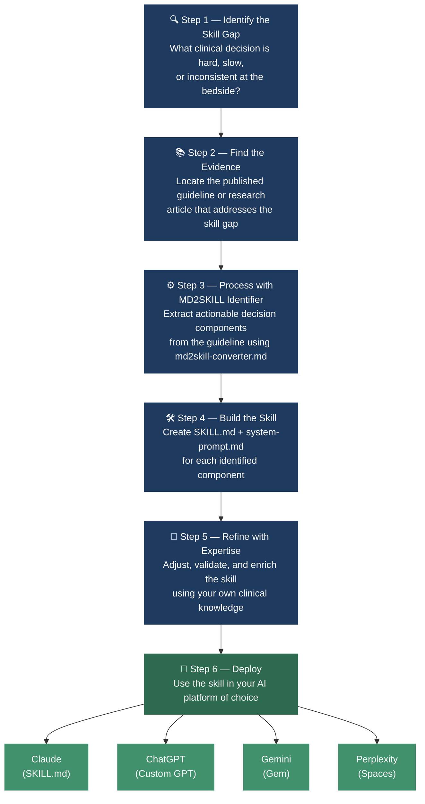

# The MD2SKILL Philosophy

MD2SKILL is built on a single conviction: **clinical AI tools should not be black boxes.** Every skill is citable, every output is traceable, and every decision step maps back to a published guideline. This document describes the six-step pipeline that turns a clinical skill gap into a deployed, evidence-backed AI skill.

---

## The Pipeline



---

## Step-by-Step Breakdown

### 🔍 Step 1 — Identify the Skill Gap

A skill gap is a clinical task that is:
- **Hard** — requires memorising a complex algorithm most clinicians don't have at the tip of their fingers
- **Slow** — takes time to look up mid-clinic, delaying the patient encounter
- **Inconsistent** — different clinicians in the same team reach different answers from the same clinical inputs
- **High-stakes** — getting it wrong has meaningful consequences for the patient

Good examples: classifying DFI severity at the bedside, selecting the right antibiotic for an infected diabetic foot, deciding whether a DBD donor kidney is transplantable, working up hypercalcaemia.

Bad examples: background reading, epidemiology summaries, literature reviews — these are not skill gaps, they are knowledge gaps. MD2SKILL only addresses the former.

**Ask yourself:** *If a registrar had to make this decision at 2am without a senior, would they struggle? If yes — that's a skill gap.*

---

### 📚 Step 2 — Find the Evidence

The skill must be grounded in a published, peer-reviewed source. In order of preference:

1. **Clinical practice guidelines** from major specialty societies (IWGDF, ADA, CMAJ, NHS, ISOT, ASH, etc.)
2. **Consensus statements** — Delphi or expert panel consensus published in a peer-reviewed journal
3. **Systematic reviews or meta-analyses** where no guideline exists
4. **High-quality primary research** only if no higher-level source covers the decision

The source must contain a **decision framework** — a classification system, algorithm, eligibility criteria, or protocol — not just findings. If the paper describes *what happens* but not *what to do*, it cannot become a skill.

Every skill in MD2SKILL carries a `Source:` line with the full citation including DOI. This is non-negotiable.

---

### ⚙️ Step 3 — Process with the MD2SKILL Identifier

Open `meta/md2skill-converter.md` and work through its phases with the guideline document. The converter will:

1. Read the document and identify **skill candidates** — distinct, self-contained clinical decision tasks
2. Present the candidates and ask which to build first
3. Extract the decision logic into a step-by-step framework
4. Distinguish skillable content (decision frameworks, algorithms, treatment selection logic) from non-skillable content (background, epidemiology, methodology)

**A skill candidate passes if:** it helps a clinician make a decision or take an action.
**A skill candidate fails if:** it helps a clinician understand something but not act on it.

One guideline often yields multiple skills. Build them one at a time.

---

### 🛠️ Step 4 — Build the Skill

Each skill produces two files:

| File | Platform | Purpose |
|---|---|---|
| `SKILL.md` | Claude, OpenClaw, Perplexity Computer | Native skill install — auto-triggers on clinical keywords |
| `system-prompt.md` | ChatGPT, Gemini, Perplexity Spaces | Paste into Instructions field |

**SKILL.md structure:**
```
---
name: skill-name-in-kebab-case
description: [One sentence on what it does. One sentence on when to trigger it — use clinical keywords a real clinician would say.]
---

# Skill Title

## Step 1 — [First decision point]
## Step 2 — [Next decision point]
...
## Guardrails
## Source
```

The description field is critical — it determines when Claude auto-triggers the skill. It must contain the natural clinical language a clinician would use, not abstract terminology.

Place each skill in the correct specialty folder:
```
skills/<specialty>/<sub-specialty>/<skill-name>/SKILL.md
skills/<specialty>/<sub-specialty>/<skill-name>/system-prompt.md
```

---

### 🧠 Step 5 — Refine with Expertise

The guideline provides the framework. Your clinical expertise provides the judgment layer that makes it usable at the bedside.

After the initial draft, review the skill and ask:

- **Is anything missing that every experienced clinician knows but the guideline doesn't state?** Add it as a guardrail.
- **Are there common pitfalls that trip up trainees?** Make them explicit.
- **Does the language match how clinicians actually talk?** Adjust phrasing so the skill triggers naturally.
- **Is the scope right?** Skills should be narrow enough to be precise, broad enough to cover the common presentations.
- **Does it hold up under edge cases?** Test it with 3–5 real or constructed cases before publishing.

This step is where your specialty knowledge matters most. The guideline is the evidence base; your expertise is the clinical validity check.

---

### 🚀 Step 6 — Deploy

Once a skill is built and validated, it deploys to any AI platform:

| Platform | File to use | How |
|---|---|---|
| **Claude** (Claude Code / Cowork) | `SKILL.md` | Drop into `.claude/skills/<skill-name>/` — auto-triggers |
| **ChatGPT Custom GPT** (single skill) | `system-prompt.md` | Paste into GPT Builder → Instructions |
| **ChatGPT Custom GPT** (multi-skill) | `SKILL.md` + master prompt | Upload to Knowledge + paste master routing prompt |
| **Gemini Gem** | `system-prompt.md` | gem.google.com → Create a Gem → Instructions |
| **Perplexity Spaces** | `system-prompt.md` | Space → Settings → Instructions |
| **Perplexity Computer** | `SKILL.md` | Native skill install |

For multi-skill ChatGPT deployments, see `meta/chatgpt-custom-gpt-setup.md` and `meta/chatgpt-master-system-prompt.md`.

---

## Core Principles

These principles apply across every step of the pipeline:

**1. Not a black box.**
Every output must be citable. Every key point traces back to a skill section, which traces back to a published guideline. This is a clinical reference standard, not a chatbot.

**2. Decisions over facts.**
Skills are about what to *do*, not what to *know*. If a piece of content doesn't end in a decision or action, it doesn't belong in a skill.

**3. Step-by-step by default.**
Clinical reasoning is sequential. Skills mirror the order a clinician naturally thinks through a problem — not the order a guideline presents information.

**4. Short enough to use mid-clinic.**
If a skill takes more than 90 seconds to read, it's too long. Trim until every sentence earns its place.

**5. One skill, one decision.**
Narrow scope keeps skills precise and reusable. A skill that tries to do everything does nothing reliably. If a guideline has three distinct decisions, build three skills.

**6. Source everything.**
Every skill ends with a `Source:` line — full citation, journal name, year, DOI. No source, no skill.

---

*See also: [`meta/md2skill-converter.md`](md2skill-converter.md) — the tool for executing Steps 3 and 4.*
*See also: [`meta/chatgpt-custom-gpt-setup.md`](chatgpt-custom-gpt-setup.md) — ChatGPT deployment guide (Step 6).*
